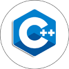

# Hello everyone 👋

My name is Lior, and I'm excited to introduce myself as a software engineer currently in my final semester at BGU University, pursuing my Bachelor's degree in Computer Science.

My passion for coding and software development has driven me towards constantly pushing the boundaries of what's possible and coming up with innovative solutions to everyday problems. I believe in leveraging technology to create a positive impact in the world, and I'm committed to using my skills to drive change.

###
Experienced in:

[][2] [!Python](Resources/Logos/py_100.png)][3] [][4] []5] 

### Reach me:

[][1]

[1]: https://www.linkedin.com/in/lior-levi96/
[2]: https://github.com/LiorLevi15/SPL-AS3
[3]: https://github.com/LiorLevi15/NLP-MINI-PROJECT
[4]: https://github.com/LiorLevi15/3DAnimations_FP
[5]: https://github.com/ThatGuyVanquish/ESPL
[6]: 

<!--
**LiorLevi15/LiorLevi15** is a ✨ _special_ ✨ repository because its `README.md` (this file) appears on your GitHub profile.

Here are some ideas to get you started:

- 🔭 I’m currently working on ...
- 🌱 I’m currently learning ...
- 👯 I’m looking to collaborate on ...
- 🤔 I’m looking for help with ...
- 💬 Ask me about ...
- 📫 How to reach me: ...
- 😄 Pronouns: ...
- ⚡ Fun fact: ...
-->
